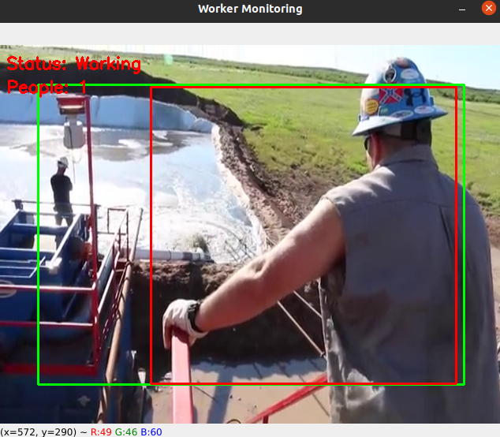
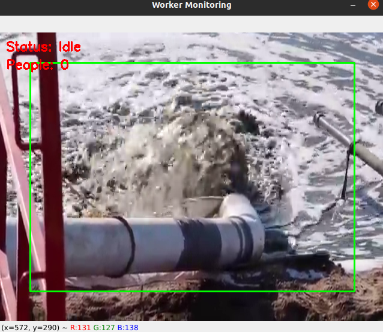

# Worker Activity Monitoring System

A computer vision-based system that monitors if a worker is actively working. This system is optimized for low-cost hardware and auto-starts on boot.

## Features

- Real-time worker activity detection using MobileNet SSD model
- Person detection and tracking
- Region of interest (ROI) monitoring
- Activity logging with timestamps
- Auto-start on system boot
- Optimized for low-cost hardware

## Installation

1. Clone the repository:
   ```
   git clone https://github.com/yourusername/worker-monitor.git
   cd worker-monitor
   ```

2. Make sure the configuration in `config.json` is correct:
   - Set the proper video source (camera index or video file path)
   - Adjust ROI coordinates to focus on the work area
   - Configure detection thresholds as needed

3. Run the installation script:
   ```
   chmod +x install.sh
   ./install.sh
   ```

4. The system will install dependencies and set up the service to start automatically on boot.
   - **Note:** The required model files will be automatically downloaded when the service runs for the first time.

## Configuration

Edit the `config.json` file to adjust the following parameters:

- `video_source`: Camera index (0, 1, etc.) or path to video file
- `roi_x`, `roi_y`, `roi_width`, `roi_height`: Region of interest coordinates
- `working_frames_threshold`: Number of consecutive active frames to consider "working"
- `idle_frames_threshold`: Number of consecutive inactive frames to consider "idle"
- `show_video`: Whether to display the video feed (set to false on headless systems)
- `model_path`: Path to the MobileNet SSD model file
- `model_config`: Path to the model configuration file
- `confidence_threshold`: Minimum confidence for person detection (0.0-1.0)
- `use_gpu`: Whether to use GPU acceleration if available

### ROI Selection Tool

The system includes a convenient ROI (Region of Interest) selection tool to help you define the monitoring area:

1. Run the ROI selection tool:
   ```
   python select_roi.py --cam <video_source>
   ```
   Where `<video_source>` is your camera index (0, 1) or video file path.

2. When the image appears, click to select 4 corner points defining your region of interest.
   - The tool will automatically close after 4 points are selected
   - The terminal will display the calculated ROI coordinates

3. Choose whether to automatically update your config.json file with the new ROI values.

4. Optionally view a visualization of the selected ROI.

Example usage:
```
python select_roi.py --cam 1.mp4
```

## Screenshots

Here are example screenshots from the monitoring system in operation:

### Working State Detection




### Idle State Detection



## Model Information

This system uses a lightweight MobileNet SSD model for human detection:
- MobileNet: A lightweight convolutional neural network designed for mobile and embedded vision applications
- SSD (Single Shot MultiBox Detector): Efficient object detection algorithm
- The model is optimized to run on CPU but can use GPU acceleration if available

## Logs

Activity logs are stored in the `activity_log.txt` file, recording all status changes with timestamps.

## Manual Operation

- Start: `sudo systemctl start worker_monitor.service`
- Stop: `sudo systemctl stop worker_monitor.service`
- Status: `sudo systemctl status worker_monitor.service`
- Run manually (for testing): `python3 worker_monitor.py`

## System Requirements

- Python 3.6+
- OpenCV with DNN module
- NumPy
- Linux with systemd (for auto-start feature)
- At least 1GB RAM for smooth operation
